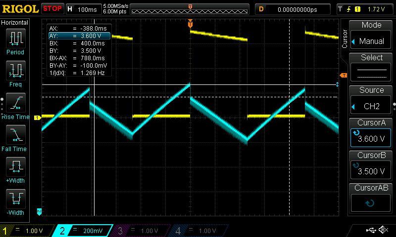

.. role:: raw-latex(raw)
   :format: latex
..

VirtCap
=======

Emulation
---------

In addition to regular emulation, shepherd provides VirtCap.
VirtCap uses an algorithm to completely virtualize the DC/DC converter and storage capacitor.
With VirtCap, users emulate any DC/DC converter.
Also the capacitor size is software configurable.
This allows to do a test sweep over various capacitor sizes, 
without having to hand replace them by hand.
VirtCap is configured by means of yml-file.

Example usage:

.. code-block:: bash

    sepherd-sheep emulate --config virtcap_settings.yml /var/shepherd/recordings/rec.0.h

Settings
--------
This is an example of a virtcap-settings file which emulates a BQ25570:

.. code-block:: yaml

    virtcap:
      upper_threshold_voltage: 3500
      lower_threshold_voltage: 3200
      sample_period_us: 10
      capacitance_uf: 1000
      max_cap_voltage: 4200
      min_cap_voltage: 0
      init_cap_voltage: 3200
      dc_output_voltage: 2300
      leakage_current: 9
      discretize: 5695
      output_cap_uf: 10
      lookup_input_efficiency: [
        [2621,3276,3440,3522,3522,3522,3522,3563,3604],
        [3624,3686,3727,3768,3768,3768,3788,3788,3788],
        [3788,3788,3788,3788,3788,3809,3809,3788,3727],
        [3706,3706,3645,3604,3481,3481,3481,3481,3481]
      ]
      lookup_output_efficiency: [
        [4995,4818,4790,4762,4735,4735,4708,4708,4681],
        [4681,4681,4681,4654,4654,4654,4654,4654,4602],
        [4551,4551,4602,4708,4708,4708,4708,4654,4654],
        [4602,4654,4681,4654,4602,4628,4628,4602,4602]
      ]

:upper_threshold_voltage: Defines the upper threshold capacitor voltage (in millivolts)
:lower_threshold_voltage: Defines the lower threshold capacitor voltage (in millivolts)
:sample_period_us: Defines the sample period of the algorithm, should be left unchanged
:capacitance_uf: Size of capacitor which is emulated (in microfarad)
:max_cap_voltage: Capacitor voltage will never reach above this voltage (in millivolts)
:min_cap_voltage: Capacitor voltage will never fall below this voltage (in millivolts)
:init_cap_voltage: Initial capacitor voltage (in millivolts)
:dc_output_voltage: Output voltage when output is on (in millivolts). Note that for now, VirtCap can only emulate a configurable fixed output voltage
:leakage_current: Static capacitor leakage current (in micro amperes)
:discretize: Period at which the upper and lower threshold voltages are checked (defined is steps of 10us). The BQ255xx defines a period of ~64ms in its datasheet. Leave at 1 if you want to check the threshold continuous
:output_cap_uf: Simulates an output capacitor which will cause an instant voltage drop in storage capacitor voltage when output turns on.
:lookup_input_efficiency: 
    Defines the input efficiency of the DC/DC converter as function of input current on a logarithmic scale.
    Each element represents input efficiency for a given input current. Since there is no floating point support,
    efficiency is defined as: :math:`0-100 \% \times 4096`
    
    | First row defines input efficiency for 0.01--0.09mA.
    | Second row defines input efficiency for 0.1--0.9mA.
    | Third row defines input efficiency for 1--9mA.
    | Fourth row defines input efficiency for 10--90mA.
:lookup_output_efficiency: 
    Defines the output efficiency of the DC/DC converter as function of output current on a logarithmic scale.
    Each element represents input efficiency for a given output current. Since there is no floating point support,
    efficiency is defined as: :math:`0-100 \% \times 4096`

    | First row defines output efficiency for 0.01--0.09mA.
    | Second row defines output efficiency for 0.1--0.9mA.
    | Third row defines output efficiency for 1--9mA.
    | Fourth row defines output efficiency for 10--90mA.

Recording
---------
The algorithm assumes that the input power traces, is recorded with the same converter as the converter you are trying to emulate.
This means that if only BQ255xx devices can be emulated using the recording option in Shepherd. It is however possible to record the input power trace with another device, and then convert those readings in the format of Shepherd (.h5).

.. role:: raw-latex(raw)
   :format: latex
..

Model
-----

The basics of the model are based on
the work of :raw-latex:`\cite{de2010design}`. The model is extended by
introducing a converter and adding other improvements.

Capacitor Voltage Model
~~~~~~~~~~~~~~~~~~~~~~~

We start from the current-voltage relation of a capacitor

.. math::

   \label{eq:iv-cap}
   V_{\text{cap}}(t) = \frac{1}{C}\int_{t_0}^{t} I(\tau)d\tau + V_{\text{cap}}(t_0),

where :math:`V_{\text{cap}}(t)` is the capacitor voltage, :math:`C` is
the capacitance, :math:`I(\tau)` is the sum of in- and outgoing current
over a period of :math:`d\tau` and :math:`V_{\text{cap}}(t_0)` is the
initial capacitor voltage at :math:`t = 0`.

By taking the derivative of `[eq:iv-cap] <#eq:iv-cap>`__, we get

.. math::

   \label{eq:iv-cap-der}
     \Delta V_{\text{cap}} = \frac{\Delta I \Delta t}{C}.

We now define :math:`V_{\text{cap}}(n)` as a discrete function,
implementing the integral of `[eq:iv-cap] <#eq:iv-cap>`__ as

.. math::

   \label{eq:vcap}
     \begin{cases}
       V_{\text{cap}}(0) = V_{\text{lt}},\\
       V_{\text{cap}}(n) = V_{\text{cap}}(n-1) + \Delta V_{\text{cap}},
     \end{cases}

where :math:`n` is an integer indicating the iteration of the function
and :math:`V_{\text{lt}}` the lower threshold capacitor voltage at which
the output turns off.

We define :math:`\Delta I` as

.. math::

   \label{eq:sumcurrent}
     \Delta I = I_{\text{cin}} - I_{\text{cout}} - I_{\text{leakage}},

where :math:`I_{\text{cin}}` is input current charging the capacitor,
:math:`I_{\text{cout}}` is current flowing out of the capacitor based on
the load and :math:`{I_{\text{leakage}}}` is the static leakage current
of the capacitor. :math:`I_{\text{cin}}` is derived as

.. math::

   \label{eq:capin}
     I_{\text{cin}} = I_{\text{in}}\frac{V_{\text{in}}}{V_{\text{cap}}}\eta_{\text{in}}(I_{\text{in}}, V_{\text{in}}),

where :math:`V_{\text{cap}}` is the voltage on the capacitor and
:math:`\eta_{\text{in}}(I_{\text{in}}, V_{\text{in}})` is the input
efficiency of the converter as function of input current
:math:`I_{\text{in}}` and input voltage :math:`V_{\text{in}}`. Note that
a converter can be composed of two stages. The first stage converts the
input voltage to the capacitor voltage. The second stage converts the
capacitor voltage to the desired output voltage.
:math:`\eta_{\text{in}}` and :math:`\eta_{\text{out}}` define the
efficiency of the first and second stage. Some converters only have the
first stage and directly output the capacitor voltage to the load.

:math:`I_{\text{cout}}` is defined as

.. math::

   \label{eq:capout}
     I_{\text{cout}} = I_{\text{out}}\frac{V_{\text{out}}}{V_{\text{cap}}\eta_{\text{out}}(I_{\text{out}}, V_{\text{out}})},

where :math:`I_{\text{out}}` is the measured output current flowing into
the load, :math:`V_{\text{out}}` is the measured output voltage applied
to the load and
:math:`\eta_{\text{out}}(I_{\text{out}}, V_{\text{out}})` is the output
efficiency as function of output current :math:`I_{\text{out}}` and
output voltage :math:`V_{\text{out}}`. :math:`V_{\text{out}}` gets
determined by

.. math::

   \label{eq:vout}
     V_{\text{out}} = V_{on} b(n, V_{\text{cap}}),

where :math:`V_{on}` is the voltage when the output is on,
:math:`b(n, V_{cap})` is a boolean determining the output state as
function of the capacitor voltage defined as

.. math::

   \begin{cases} 
       b(0)(V_{\text{cap}}) = \text{false}, \\
       b(n)(V_{\text{cap}}) = 
       \begin{cases} 
         \text{true},       & \text{if } \text{not}(b(n-1)) \text{\ and\ } (V_{\text{cap}} > V_{\text{ut}}), \\
         \text{false},       & \text{if } b(n-1) \text{\ and\ } (V_{\text{cap}}, < V_{\text{lt}}), \\
         b_{n-1,} & \text{otherwise},
       \end{cases}
     \end{cases}

where :math:`V_{\text{ut}}` is the upper threshold capacitor voltage and
:math:`V_{\text{lt}}` the lower threshold capacitor voltage at which,
respectively, the output turns on and off.

Output Capacitor Compensation
~~~~~~~~~~~~~~~~~~~~~~~~~~~~~

Converters can have a small output capacitor. When the output turns on,
the bigger storage capacitor instantly charges the output capacitor.
This causes the storage capacitor voltage to drop as shown in
Figure \ `1.1 <#fig:vcap-drop>`__. To increase the accuracy of our
emulation we model this voltage drop by calculating
:math:`V_{\text{new}}`.

   		voltage (in yellow) from a solar-powered bq25570 converter with a 
   		94 storage capacitor, 22 output capacitor and 1 kΩ load. While the 
   		output is off, the capacitor voltage charges until it reaches its 
   		upper threshold voltage. When the output voltage turns on, the 
   		capacitor voltage drops 0.1 V.

   Scope image of storage capacitor voltage (in blue) and output 
   voltage (in yellow) from a solar-powered bq25570 converter with a 
   94 storage capacitor, 22 output capacitor and 1 kΩ load. While the 
   output is off, the capacitor voltage charges until it reaches its 
   upper threshold voltage. When the output voltage turns on, the 
   capacitor voltage drops 0.1 V.

As the output turns on, energy will transfer between the capacitors,
defined as

.. math::

   \label{eq:energy-eq}
     E_{\text{new}} = E_{\text{old}} - E_{\text{output}},

where :math:`E_{\text{new}}` and :math:`E_{\text{old}}` is the energy
level in the storage capacitor before and after the output turns on
respectively; :math:`E_{\text{output}}` is the energy stored in the
output capacitor. We are interested in the capacitor voltage. The
relation between capacitor voltage and energy is defined as

.. math::

   \label{eq:energy-cap}
     E = \frac{CV^2}{2},

where :math:`E` is the energy in the capacitor, :math:`C` is the
capacitance and :math:`V` the capacitor voltage. We combine
`[eq:energy-cap] <#eq:energy-cap>`__ and
`[eq:energy-eq] <#eq:energy-eq>`__

.. math::

   \label{eq:energy-cap-eq}
     \frac{C_{\text{storage}}V_{\text{new}}^2}{2} = \frac{C_{\text{storage}}V_{\text{old}}^2}{2} - \frac{C_{\text{output}}V_{\text{new}}^2}{2}.

Rewriting `[eq:energy-cap-eq] <#eq:energy-cap-eq>`__ we get

.. math::

   \label{eq:vout-eq2}
     V_{\text{new}} = \sqrt{\frac{C_{\text{storage}}}{C_{\text{storage}} + C_{\text{output}}}}V_{\text{old}}.
